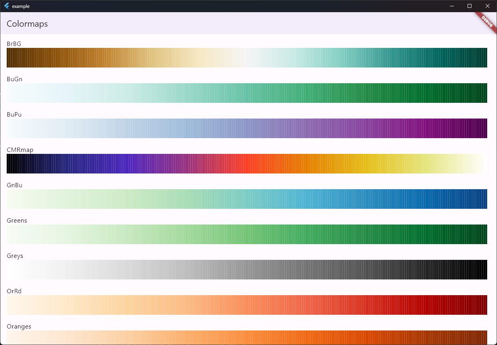

<!--
This README describes the package. If you publish this package to pub.dev,
this README's contents appear on the landing page for your package.

For information about how to write a good package README, see the guide for
[writing package pages](https://dart.dev/guides/libraries/writing-package-pages).

For general information about developing packages, see the Dart guide for
[creating packages](https://dart.dev/guides/libraries/create-library-packages)
and the Flutter guide for
[developing packages and plugins](https://flutter.dev/developing-packages).
-->

# color_map_dart

[](https://pub.dev/packages/color_map)

Colormaps for Dart/Flutter imported from Matplotlib.colormaps.

## Features



For more information about Colormaps, please check out [Choosing Colormaps in Matplotlib](https://matplotlib.org/stable/tutorials/colors/colormaps.html).

## Getting started

```dart
import `package:color_map/color_map.dart`;
```

## Usage

Colormap is callable. It accepts doubles from 0 to 1.

```dart
void main() {
    final cmap = Colormaps.jet;
    final result = [];
    for (i = 0; i < 256; i++) {
        result.add(cmap(i / 255));
    }
}
```

## List of Colormaps

```dart
final colormaps = [
  "Blues", "BrBG", "BuGn", "BuPu", "CMRmap", "GnBu", "Greens", "Greys", "OrRd", "Oranges", "PRGn", "PiYG", "PuBu", "PuBuGn", "PuOr", "PuRd", "Purples", "RdBu", "RdGy", "RdPu", "RdYlBu", "RdYlGn", "Reds", "Spectral", "Wistia", "YlGn", "YlGnBu", "YlOrBr", "YlOrRd", "afmhot", "autumn", "binary", "bone", "brg", "bwr", "cool", "coolwarm", "copper", "cubehelix", "flag", "gist_earth", "gist_gray", "gist_heat", "gist_ncar", "gist_rainbow", "gist_stern", "gist_yarg", "gnuplot", "gnuplot2", "gray", "hot", "hsv", "jet", "nipy_spectral", "ocean", "pink", "prism", "rainbow", "seismic", "spring", "summer", "terrain", "winter", "Accent", "Dark2", "Paired", "Pastel1", "Pastel2", "Set1", "Set2", "Set3", "tab10", "tab20", "tab20b", "tab20c", "magma", "inferno", "plasma", "viridis", "cividis", "twilight", "twilight_shifted", "turbo", "Blues_r", "BrBG_r", "BuGn_r", "BuPu_r", "CMRmap_r", "GnBu_r", "Greens_r", "Greys_r", "OrRd_r", "Oranges_r", "PRGn_r", "PiYG_r", "PuBu_r", "PuBuGn_r", "PuOr_r", "PuRd_r", "Purples_r", "RdBu_r", "RdGy_r", "RdPu_r", "RdYlBu_r", "RdYlGn_r", "Reds_r", "Spectral_r", "Wistia_r", "YlGn_r", "YlGnBu_r", "YlOrBr_r", "YlOrRd_r", "afmhot_r", "autumn_r", "binary_r", "bone_r", "brg_r", "bwr_r", "cool_r", "coolwarm_r", "copper_r", "cubehelix_r", "flag_r", "gist_earth_r", "gist_gray_r", "gist_heat_r", "gist_ncar_r", "gist_rainbow_r", "gist_stern_r", "gist_yarg_r", "gnuplot_r", "gnuplot2_r", "gray_r", "hot_r", "hsv_r", "jet_r", "nipy_spectral_r", "ocean_r", "pink_r", "prism_r", "rainbow_r", "seismic_r", "spring_r", "summer_r", "terrain_r", "winter_r", "Accent_r", "Dark2_r", "Paired_r", "Pastel1_r", "Pastel2_r", "Set1_r", "Set2_r", "Set3_r", "tab10_r", "tab20_r", "tab20b_r", "tab20c_r", "magma_r", "inferno_r", "plasma_r", "viridis_r", "cividis_r", "twilight_r", "twilight_shifted_r", "turbo_r"
];
```
